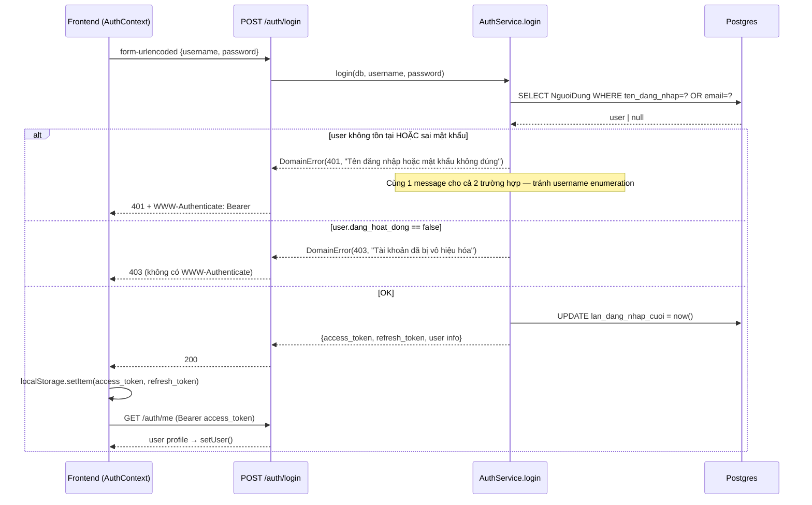
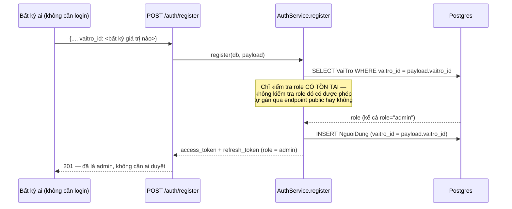
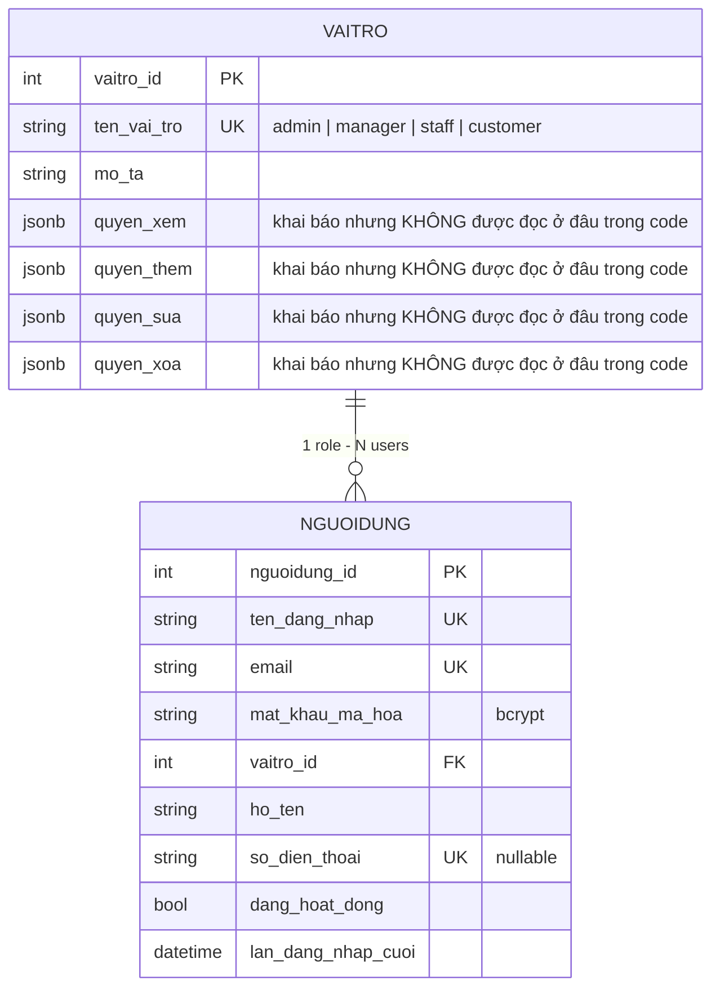

# Spec 01 — Auth & Access Control

Status: DRAFT — chờ chốt (review) trước khi dùng làm source of truth cho Phase 2.
Phạm vi: `POST /auth/register`, `POST /auth/login`, `POST /auth/refresh`, `GET /auth/me`, `require_role`/`get_current_user` (RBAC), frontend `AuthContext`/`ProtectedRoute`/`AdminProtectedRoute`.
Code liên quan: `app/routers/auth.py`, `app/services/auth/auth_service.py`, `app/core/security.py`, `app/core/dependencies.py`, `app/models.py` (`NguoiDung`, `VaiTro`), `frontend/src/contexts/AuthContext.tsx`, `frontend/src/services/{authService,api}.ts`, `frontend/src/components/routing/ProtectedRoute.tsx`, `frontend/src/components/admin/routing/AdminProtectedRoute.tsx`.

---

## 1. Business Value

Auth là domain nền — mọi domain khác (Orders, Payments, Inventory...) đều đứng trên giả định "current_user đã được xác thực đúng và có đúng role". Giá trị business cụ thể:

- Phân biệt khách hàng (customer) mua hàng công khai vs. nhân viên vận hành nội bộ (staff/manager/admin) truy cập dữ liệu tồn kho, đơn hàng, doanh thu — dữ liệu nhạy cảm không được lộ ra ngoài.
- RBAC 4 cấp (`admin > manager > staff > customer`, dạng flat — không có inheritance) cho phép phân quyền vận hành: staff nhập kho được nhưng không xem báo cáo doanh thu; manager xem báo cáo nhưng một số thao tác xoá vẫn chỉ admin mới làm được.
- Đây là **domain rủi ro cao nhất** trong toàn hệ thống — một lỗ hổng ở đây (như Finding #1 dưới) làm mọi RBAC ở các domain khác vô nghĩa, vì kẻ tấn công tự cấp quyền admin cho chính mình.

## 2. Technical Design hiện tại

### 2.1 Luồng Login



### 2.2 Luồng Register — nơi có lỗ hổng nghiêm trọng



### 2.3 Token & vòng đời session

- Access token JWT (HS256), hết hạn **30 phút** (`ACCESS_TOKEN_EXPIRE_MINUTES`, mặc định).
- Refresh token JWT, hết hạn **7 ngày** (`REFRESH_TOKEN_EXPIRE_DAYS`).
- `POST /auth/refresh` tồn tại ở backend, nhận `refresh_token` → trả access token mới. **Nhưng frontend không bao giờ gọi endpoint này** (đã grep toàn bộ `frontend/src`, không có lời gọi `/auth/refresh` nào).
- `apiClient.request()` (`frontend/src/services/api.ts`): khi nhận 401, chỉ xoá token khỏi `localStorage`, không thử refresh.
- Hệ quả thực tế: **user bị đăng xuất đột ngột sau 30 phút không thao tác gì mới**, kể cả khi refresh token (còn hạn 7 ngày) hoàn toàn hợp lệ. Với luồng checkout (khách điền form giao hàng, chọn ngày nhận...) 30 phút là ngắn — rủi ro mất giỏ hàng/mất session giữa chừng.
- Token lưu ở `localStorage` (không phải httpOnly cookie) → dễ bị đọc bởi XSS nếu có lỗ hổng XSS ở nơi khác trong app. Đây là trade-off phổ biến ở app quy mô nhỏ, chấp nhận được, nhưng cần ghi nhận rõ — không phải "quên".

### 2.4 RBAC

`require_role(*roles)` (dependency factory) — so khớp **tên role chính xác** (case-sensitive) với `current_user.vaitro.ten_vai_tro`. Roles đang dùng trong code: `admin`, `manager`, `staff`, `customer` (customer chỉ ngầm định — không endpoint nào liệt kê "customer" trong `require_role`, các endpoint customer-facing chỉ cần `get_current_user`/`get_current_active_user`, bất kỳ role nào cũng qua được).

Điểm cần lưu ý: RBAC là **flat list mỗi endpoint**, không có khái niệm role hierarchy tập trung. Thêm role thứ 5 (vd `warehouse_lead`) nghĩa là phải rà lại từng router xem có nên thêm vào list hay không — không có 1 chỗ định nghĩa "role nào kế thừa quyền role nào".

### 2.5 ERD (phần liên quan Auth)



**Phát hiện:** 4 cột `quyen_xem/quyen_them/quyen_sua/quyen_xoa` (JSONB, permission chi tiết per-role) tồn tại trong schema nhưng **không có chỗ nào trong code đọc các cột này** — toàn bộ RBAC thực tế chạy qua `require_role()` hardcode theo tên role ở từng router. Đây là dead schema — hoặc là ý định ban đầu (permission matrix chi tiết hơn role-name) chưa được implement, hoặc là tàn dư từ thiết kế cũ. Cần quyết định: implement để dùng thật, hay bỏ khỏi schema cho gọn.

## 3. API Contract

| Method | Path | Auth | Request | Response thành công | Ghi chú |
|---|---|---|---|---|---|
| POST | `/auth/register` | Public | `UserRegister` (gồm `vaitro_id` tự chọn) | 201, `LoginResponse` (đã có token) | **Xem Finding #1** |
| POST | `/auth/login` | Public | OAuth2 form (`username`, `password`) | 200, `LoginResponse` | username = username hoặc email |
| POST | `/auth/refresh` | Public (cần `refresh_token` hợp lệ) | `{refresh_token}` | 200, `TokenResponse` | Backend có, frontend chưa gọi (xem Finding #2) |
| GET | `/auth/me` | Bearer access token | — | 200, user profile | |

## 4. Findings — theo mức độ nghiêm trọng

### 🔴 CRITICAL — #1: Privilege escalation qua `/auth/register` — ĐÃ FIX

**Trạng thái: đã vá (hotfix, ngoài lịch trình audit domain).** `AuthService.register()` không còn nhận `vaitro_id` từ client nữa — role luôn được tra theo tên `"customer"` server-side. Field `vaitro_id` đã bị xoá khỏi `UserRegister` schema (`app/routers/auth.py`) và khỏi `RegisterData` ở frontend (`types/user.ts`, `AuthContext.tsx`, `RegisterPage.tsx`). Test khoá hành vi: `tests/test_auth_service.py::TestRegister::test_always_assigns_customer_role_even_if_caller_supplies_a_different_one` — dựng payload có `vaitro_id` trỏ tới role admin, assert user tạo ra vẫn là customer.

Tác dụng phụ có chủ đích: nếu DB chưa có role tên đúng `"customer"` (vd môi trường mới chưa seed), `/auth/register` giờ trả 500 thay vì tạo được user với role tuỳ ý — đúng hướng (fail-safe thay vì fail-open), nhưng cần đảm bảo role `"customer"` luôn được seed trước khi deploy (xem domain Cross-cutting — chưa có seed script chính thức cho `VaiTro`, hiện chỉ có qua `create_test_user.py`/`scripts/seed_order_test_data.py` không phải seed chuẩn cho production).

Mô tả gốc của lỗ hổng (trước khi fix), giữ lại để tham chiếu:

Bất kỳ ai gọi thẳng API (không qua UI) đều có thể tự đăng ký tài khoản với `vaitro_id` bất kỳ, kể cả admin. Frontend chỉ hardcode `DEFAULT_CUSTOMER_ROLE_ID = 4` ở `RegisterPage.tsx` — đây là quy ước UI, **không phải kiểm soát bảo mật**, bypass được bằng 1 request `curl`/Postman.

Đối chiếu để chắc chắn không phải false positive: `POST /users` (tạo user từ admin panel) có kiểm soát đúng — router gate `require_role("admin")`, còn `PUT /users/{id}` khi đổi `vaitro_id` cũng bắt buộc `is_admin` (xem `user_service.py:145-147`). Chỉ riêng `/auth/register` — đúng theo thiết kế OAuth2 public registration — là thiếu ràng buộc.

**Đề xuất fix (nhỏ, không phá vỡ gì)**: `AuthService.register()` ép cứng role tự đăng ký luôn là role "customer" mặc định của hệ thống (đọc theo tên `"customer"`, không nhận `vaitro_id` từ request nữa), hoặc nếu vẫn muốn nhận `vaitro_id` thì whitelist chỉ role có `ten_vai_tro == "customer"` mới được tự gán qua endpoint này. Việc tạo tài khoản staff/manager/admin bắt buộc đi qua `POST /users` (đã có role-gate đúng).

Đây là lỗi tồn tại từ code gốc (không phải do Phase 1 refactor gây ra — Phase 1 move verbatim, đúng theo nguyên tắc preserve-behavior). Khuyến nghị: fix ngay, độc lập với lịch trình audit domain khác, vì đây là lỗ hổng đang mở trên production nếu đã deploy.

### 🟠 HIGH — #2: Không có silent token refresh → mất session sau 30 phút

`POST /auth/refresh` tồn tại nhưng frontend không gọi. Khi access token hết hạn (30 phút mặc định), request tiếp theo nhận 401 → `apiClient` xoá token → user bị văng ra dù `refresh_token` còn hạn 7 ngày. Trải nghiệm xấu nhất ở luồng checkout dài (khách đang điền form thì bị đăng xuất, có thể mất giỏ hàng).

**Đề xuất**: thêm interceptor trong `apiClient.request()` — khi nhận 401 lần đầu, thử `POST /auth/refresh` với `refresh_token` đang lưu, nếu thành công thì lưu access token mới và retry request gốc đúng 1 lần; nếu refresh cũng fail mới logout thật.

### 🟡 MEDIUM — #3: Không có forgot-password / reset-password

Không tìm thấy trang hay endpoint reset mật khẩu nào trong cả frontend lẫn backend. User quên mật khẩu hiện không có cách tự khôi phục — phải nhờ admin can thiệp trực tiếp trên DB. Cần có trong roadmap modernize nếu muốn "revive" sản phẩm này ra dùng thật.

### 🟡 MEDIUM — #4: Không có rate-limit / lockout cho login

`AuthService.login()` không giới hạn số lần thử sai. Kết hợp với message lỗi giống nhau cho "sai mật khẩu" và "không tồn tại user" (đây là **điểm làm đúng** — tránh username enumeration) nhưng thiếu rate-limit vẫn để ngỏ brute-force password nếu attacker đã biết username/email.

### 🟢 LOW — #5: 4 cột permission JSONB trong `VaiTro` không được dùng

Xem mục 2.5 — dead schema hoặc tính năng permission-matrix dang dở. Cần quyết định: implement (cho phép admin tuỳ biến quyền theo role thay vì hardcode `require_role` list ở mỗi router) hay xoá khỏi schema.

### 🟢 LOW — #6: `AdminProtectedRoute` dùng fallback `vaitro_id === 1` để đoán admin

```tsx
const isAdmin = user?.vaitro?.ten_vai_tro?.toLowerCase() === 'admin' ||
                user?.vaitro?.vaitro_id === 1 // Assuming admin role_id is 1
```
Comment tự thừa nhận "Assuming" — nếu seed data khác ID 1 = admin (vd id 1 = customer do thứ tự insert khác), route này cho phép **sai người** vào admin panel, hoặc chặn nhầm admin thật. Đây chỉ là frontend route-guard (backend vẫn chặn đúng qua `require_role`), nên rủi ro thực tế thấp — nhưng vẫn nên bỏ nhánh `vaitro_id === 1`, chỉ giữ so tên role.

## 5. Trade-off đã chấp nhận (không phải bug, ghi nhận để không bị "phát hiện lại")

- JWT trong `localStorage` thay vì httpOnly cookie — đơn giản hơn để triển khai SPA + API riêng biệt (CORS), đổi lại chịu rủi ro XSS-exposed token. Chấp nhận được ở quy mô hiện tại; nên revisit nếu mở rộng sang nhiều domain/subdomain.
- RBAC flat theo tên role, không hierarchy — đủ dùng với 4 role cố định, sẽ khó maintain nếu số role tăng lên nhiều (>6-7 role) hoặc cần permission chi tiết hơn theo từng resource.

## 6. Modernize / New-feature roadmap (theo mục tiêu "revive & phát triển tính năng mới")

Ưu tiên đề xuất, theo effort tăng dần:

1. Vá Finding #1 (privilege escalation) — bắt buộc trước khi làm gì khác với domain này.
2. Thêm silent refresh (Finding #2) — cải thiện UX ngay, effort thấp.
3. Forgot/reset password qua email (Finding #3) — cần thêm email service (chưa có trong hệ thống hiện tại, xem domain Cross-cutting).
4. Rate-limit login (Finding #4) — có thể làm ở middleware level, effort thấp-trung bình.
5. Refresh token rotation + revoke list (nếu muốn hỗ trợ "đăng xuất khỏi mọi thiết bị") — effort trung bình, cần thêm bảng lưu refresh token đã revoke hoặc chuyển sang short-lived + rotating refresh.
6. Social login (Google/Facebook) — tính năng mới, effort trung bình-cao, cân nhắc theo nhu cầu thật (không thêm chỉ vì "cho hiện đại" — đúng nguyên tắc Product First của dự án).
7. 2FA cho admin/manager — tính năng mới, ưu tiên thấp trừ khi có yêu cầu bảo mật cụ thể.

---

**Cần m chốt trước khi qua domain tiếp theo:**
- Đồng ý thứ tự domain tiếp theo là **Orders** (domain #2 trong roadmap đã thống nhất)?
- Finding #1 (privilege escalation) — fix ngay bây giờ (tách riêng, không đợi hết audit), hay gom vào cuối cùng với tất cả finding khác?
- Roadmap mục 6 (modernize) — có cái nào muốn priority khác, hoặc loại bỏ khỏi phạm vi?
