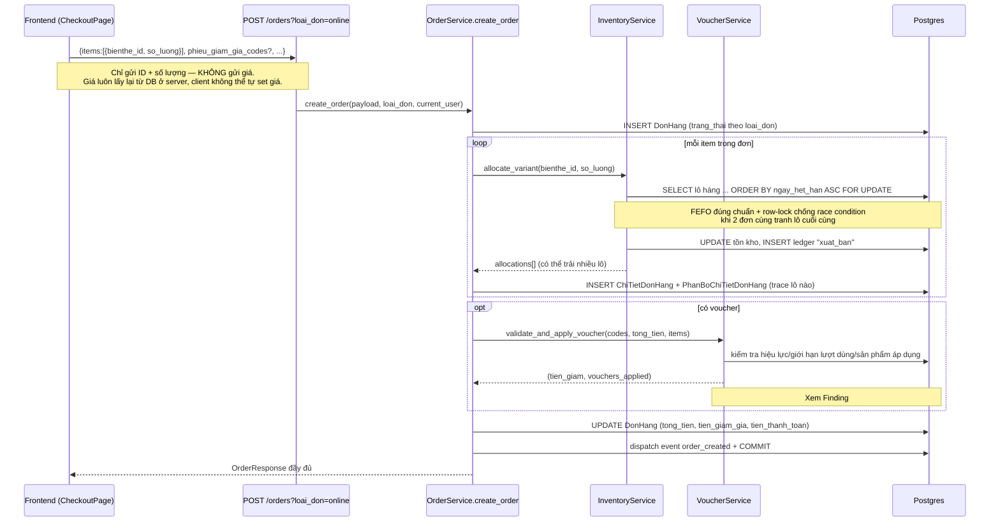
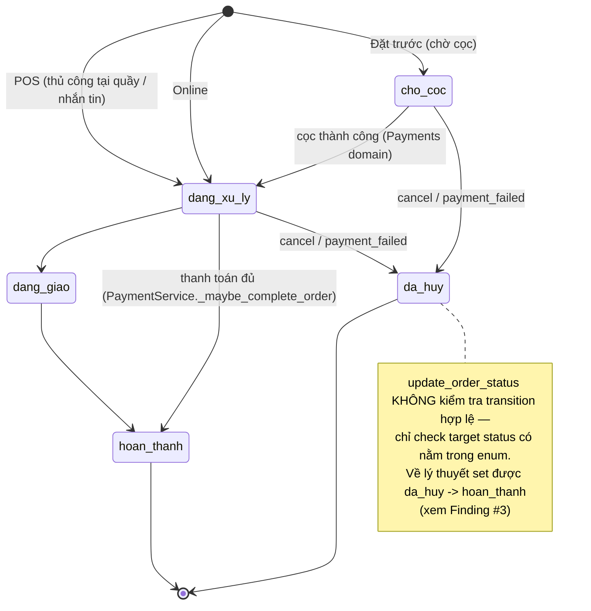
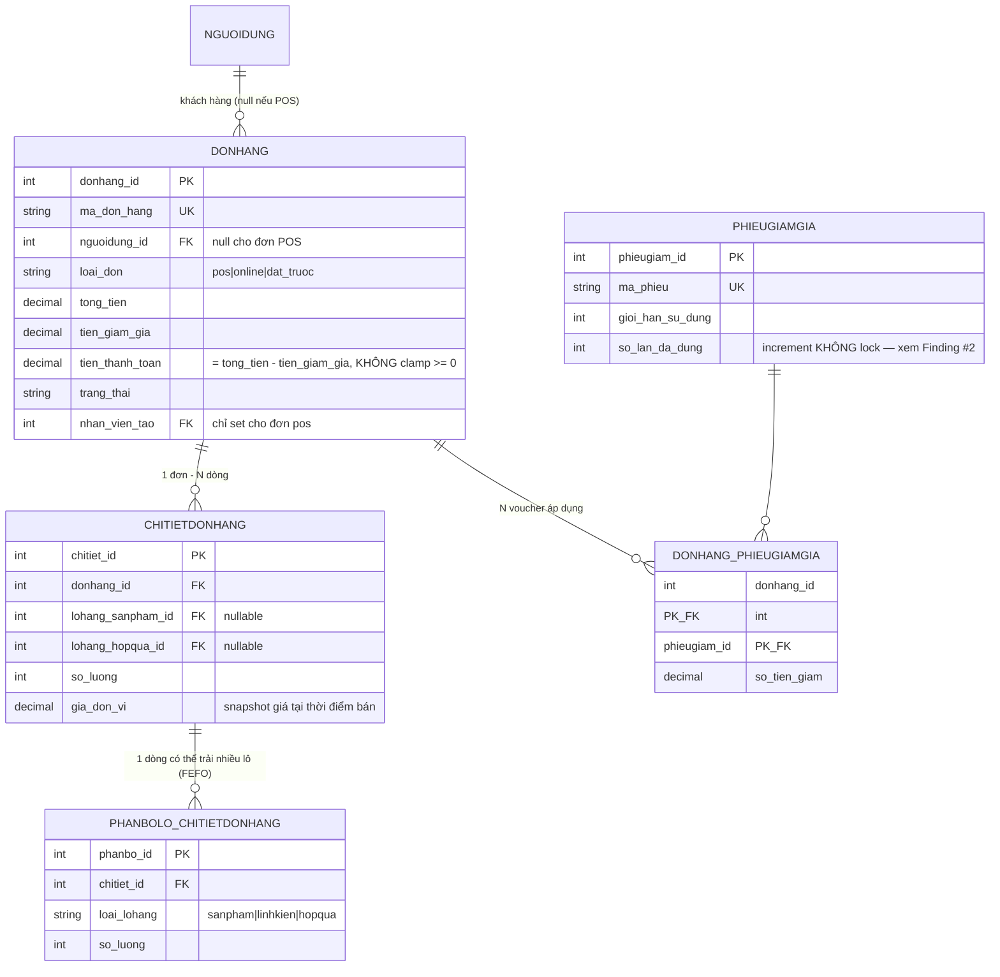

# Spec 02 — Orders (core business flow)

Status: DRAFT — chờ chốt.
Phạm vi: `app/routers/orders.py`, `app/services/orders/{order_service,inventory_service,voucher_service,types,errors}.py`, frontend `CartContext`, `CheckoutPage`, `services/{cartService,orderService,voucherService}.ts`.
Domain liên quan nhưng audit riêng: Payments (domain 3 — luồng thanh toán/MoMo hoàn tất đơn `cho_coc`/`dang_xu_ly` → `hoan_thanh`), Inventory (domain 4 — FEFO allocation chi tiết hơn).

---

## 1. Business Value

Orders là domain trung tâm — nơi 3 nguồn giá trị business gặp nhau: bán hàng tại quầy (POS), bán online, và đặt trước (pre-order, có đặt cọc). Một đơn hàng tạo ra đồng thời: trừ tồn kho (theo FEFO — lô hết hạn sớm nhất bán trước, giảm thất thoát hàng hết hạn), áp voucher, và sinh audit trail (ledger nhập/xuất kho) cho từng thao tác. Đây là domain mà lỗi có tác động tài chính trực tiếp (sai số tiền thanh toán, bán vượt tồn kho, mất lịch sử kiểm toán).

## 2. Technical Design hiện tại

### 2.1 Luồng tạo đơn (happy path — online)

### 2.2 State machine trạng thái đơn hàng

Enum thực tế trong code: `cho | cho_coc | dang_xu_ly | dang_giao | hoan_thanh | da_huy`.

> **Cập nhật 2026-08-21**: trước đây đơn `pos` ("Thủ công") bị hardcode thẳng `hoan_thanh` ngay lúc `create_order`, kể cả khi tạo qua `ManualOrderForm` — form này **không thu tiền**, nên đơn $0-đã-thanh-toán vẫn hiện "Hoàn thành" (ăn luôn vào doanh thu ở `analytics_service.py`/`report_service.py`, vốn lọc theo `trang_thai == "hoan_thanh"`). Đã sửa: `pos` giờ khởi tạo `dang_xu_ly` giống `online`, đi qua đúng đường có sẵn — nhân viên tự chuyển trạng thái qua `PUT/PATCH /orders/{id}/status`, hoặc tự động hoàn tất khi `PaymentService._maybe_complete_order` thấy tổng thanh toán ≥ `tien_thanh_toan` (vì `dang_xu_ly` nằm trong `_COMPLETABLE_STATUSES`). Diagram bên dưới đã phản ánh hành vi mới.

`PUT/PATCH /orders/{id}/status` nhận `trang_thai` (hoặc alias `thanh_toan`/`da_nhan`/`huy` — map lại thành `hoan_thanh`/`hoan_thanh`/`da_huy`). Router không có `require_role` — quyền được check **bên trong service** (`vaitro_ten not in ["admin","manager"]` → 403). Đây là điểm khác biệt so với mọi router khác trong hệ thống (tất cả đều gate ở router qua `Depends(require_role(...))`) — đã verify kỹ, không phải lỗ hổng (permission vẫn đúng), nhưng là 1 pattern lệch chuẩn, dễ gây nhầm khi review nhanh router mà tưởng endpoint không có auth-gate.

### 2.3 ERD

`gia_don_vi` được snapshot vào `ChiTietDonHang` tại thời điểm bán — đúng thiết kế (nếu giá sản phẩm đổi sau này, đơn hàng cũ vẫn giữ đúng giá đã bán, không bị tính lại theo giá mới). `PhanBoChiTietDonHang` cho phép 1 dòng chi tiết đơn hàng trải trên nhiều lô hàng khác nhau (vd khách mua 10 cái, lô A còn 6, lô B đủ 4 — FEFO tự động split) — thiết kế đúng cho truy vết lô/hạn sử dụng.

## 3. API Contract

| Method | Path | Auth | Ghi chú |
|---|---|---|---|
| GET | `/orders` | `get_current_user` (auto lọc: customer chỉ thấy đơn của mình, admin/manager thấy hết) | |
| GET | `/orders/{id}` | `get_current_user` + check ownership trong service | |
| POST | `/orders?loai_don=` | `get_current_user` | Không có price injection — server tự tính giá |
| PUT/PATCH | `/orders/{id}/status` | `get_current_user` + check role trong service (admin/manager) | Không validate transition — Finding #3 |
| POST | `/orders/{id}/cancel` | `get_current_user` + ownership/trạng thái check trong service | Soft-cancel đúng chuẩn, khôi phục tồn kho + voucher |
| DELETE | `/orders/{id}` | `require_role("admin","manager")` ở router | **Hard delete — Finding #4, nghiêm trọng nhất domain này** |

## 4. Findings

### 🔴 HIGH — #1: Nhiều voucher cộng dồn có thể vượt quá `tong_tien` → `tien_thanh_toan` âm

`VoucherService.validate_and_apply_voucher` cap từng voucher riêng lẻ: `tien_giam = min(tien_giam, order_total)`. Nếu request có `phieu_giam_gia_codes: [code1, code2]` và cả 2 đều giảm gần 100% order_total, tổng `tien_giam_tong` không bị cap lại theo order_total sau khi cộng — `order_service.py:302` chạy thẳng `tien_thanh_toan = tong_tien - tien_giam` không có `max(Decimal("0"), ...)`.

Không thấy được qua UI hiện tại (`CartContext.applyVoucher` chỉ giữ 1 `AppliedVoucher`), nhưng `phieu_giam_gia_codes` là mảng ở cả schema backend lẫn type frontend (`OrderCreate.phieu_giam_gia_codes?: string[]`) — bất kỳ ai gọi thẳng API với 2+ mã đều kích hoạt được. Rủi ro tài chính nếu voucher giảm giá sâu tồn tại song song (khá phổ biến trong campaign marketing).

**Đề xuất fix**: sau khi cộng `tien_giam_tong` trong `create_order`, clamp `tien_thanh_toan = max(Decimal("0"), tong_tien - tien_giam)`; cân nhắc thêm giới hạn "chỉ áp dụng 1 voucher/đơn" nếu đó là chủ ý business (đơn giản, ít rủi ro hơn multi-voucher stacking).

### 🟡 MEDIUM — #2: Giới hạn lượt dùng voucher không có row-lock — race condition

`voucher.so_lan_da_dung >= voucher.gioi_han_su_dung` được check rồi tăng (`+= 1`) sau, không qua `.with_for_update()` — khác với `InventoryService` (đã làm đúng, có lock). Hai request đồng thời cùng dùng nốt lượt cuối của 1 voucher đều có thể pass check trước khi request kia commit → voucher bị dùng vượt giới hạn. Tác động: mất tiền theo chương trình khuyến mãi, không phải sập hệ thống — độ ưu tiên thấp hơn Finding #1 nhưng cùng loại lỗi (thiếu lock ở business-critical counter).

### 🟡 MEDIUM — #3: `update_order_status` không kiểm tra transition hợp lệ

Chỉ validate `trang_thai` nằm trong enum 6 giá trị, không kiểm tra đường đi từ trạng thái hiện tại có hợp lệ không. Hệ quả cụ thể: admin/manager (vô tình thao tác nhầm, hoặc do UI cho phép chọn tự do) có thể set 1 đơn `da_huy` (đã hoàn tồn kho) quay lại `hoan_thanh` — đơn hiện "hoàn thành" trên hệ thống nhưng tồn kho không được trừ lại lần 2 (logic trừ kho chỉ chạy trong `create_order`). Kết quả: đơn hàng "ma" — hệ thống nghĩ đã bán nhưng không có hàng thật đứng sau nó.

**Đề xuất**: thêm bảng chuyển trạng thái hợp lệ (dict `{trạng_thái_hiện_tại: {các trạng thái được phép chuyển tới}}`), reject nếu không khớp.

### 🔴 HIGH — #4: `DELETE /orders/{id}` xóa cứng, phá vỡ audit trail

Đây là finding đáng chú ý nhất domain Orders. `delete_order()` xóa vĩnh viễn không chỉ đơn hàng mà cả:
- `PhanBoChiTietDonHang` (trace lô hàng)
- `LichSuKhoSanPham/LinhKien/HopQua` — **toàn bộ ledger nhập/xuất kho liên quan tới đơn này**
- `ThanhToan` (lịch sử thanh toán)
- `DanhGiaSanPham`, `DoiTra`, `DonHangPhieuGiamGia`

So với `cancel_order` (soft-cancel: giữ nguyên đơn, set `trang_thai = da_huy`, khôi phục tồn kho bằng ledger entry MỚI kiểu `tra_hang` — đúng chuẩn kế toán, có thể trace ngược), `delete_order` xóa sạch dấu vết như chưa từng tồn tại. Điều này **trực tiếp mâu thuẫn với nguyên tắc chính chủ dự án đã đặt ra** ("Database design... Prioritize: consistency, scalability, **auditability, traceability**").

Endpoint này chỉ `require_role("admin","manager")`, không có double-confirm, không có lý do bắt buộc (`ly_do` không phải field bắt buộc như `cancel_order` yêu cầu). Một manager bấm nhầm nút xóa là mất vĩnh viễn lịch sử giao dịch — không thể khôi phục trừ khi có backup DB riêng.

**Đề xuất**: đổi `delete_order` thành soft-delete (thêm cột `da_xoa`/`deleted_at` hoặc tái sử dụng `trang_thai` + cờ ẩn khỏi danh sách mặc định), hoặc nếu bắt buộc phải hard-delete thật (vd yêu cầu pháp lý xóa dữ liệu), giới hạn chỉ cho đơn ở trạng thái `da_huy` từ lâu và bắt buộc `ly_do` + log riêng ai xóa/khi nào trước khi xóa.

### 🟢 LOW — #5: Lộ chi tiết lỗi nội bộ qua message 500

`create_order`, `cancel_order`, `delete_order` đều có `except Exception as e: raise DomainError(500, f"... {str(e)}")` — trả thẳng message exception Python (có thể chứa tên bảng/cột SQL) ra API response. Rủi ro thấp (không phải lỗ hổng khai thác trực tiếp) nhưng nên log nội bộ và trả message chung chung cho client.

## 5. Điểm làm đúng (ghi nhận, không phải để "tìm thêm lỗi")

- **FEFO + row-lock đúng chuẩn**: `InventoryService.allocate_*` dùng `ORDER BY ngay_het_han ASC` kết hợp `.with_for_update()` — vừa đúng nghiệp vụ (bán hàng gần hết hạn trước) vừa an toàn concurrency (2 đơn tranh lô cuối không bị double-sell). Đây là phần thiết kế tốt nhất trong domain này.
- **Giá luôn tính từ server**: client chỉ gửi ID + số lượng, không gửi giá — loại bỏ hoàn toàn khả năng khách tự ý sửa giá qua request.
- **Snapshot giá tại thời điểm bán** (`gia_don_vi` lưu trong `ChiTietDonHang`) — đơn hàng cũ không bị ảnh hưởng khi giá sản phẩm thay đổi sau này.

## 6. Modernize / New-feature roadmap

1. Fix Finding #1 (clamp tổng giảm giá) — bắt buộc trước khi có campaign nhiều voucher.
2. Fix Finding #4 (soft-delete thay hard-delete) — ưu tiên cao, bảo vệ dữ liệu kế toán.
3. Transition-graph cho order status (Finding #3) — effort thấp, ngăn lỗi thao tác admin.
4. Row-lock cho voucher usage counter (Finding #2) — effort thấp.
5. Tính năng mới cân nhắc: theo dõi trạng thái đơn theo timeline (order history log riêng thay vì nhồi vào `ghi_chu` dạng text nối chuỗi như hiện tại — khó query/báo cáo về sau).

---

**Cần m chốt trước khi qua domain 3 (Payments):**
- Finding #4 (hard-delete) — fix ngay như đã làm với Auth, hay gom vào cuối audit?
- Finding #1 (voucher stacking) — có drop luôn xuống "chỉ 1 voucher/đơn" cho đơn giản, hay giữ multi-voucher và chỉ clamp tổng?
