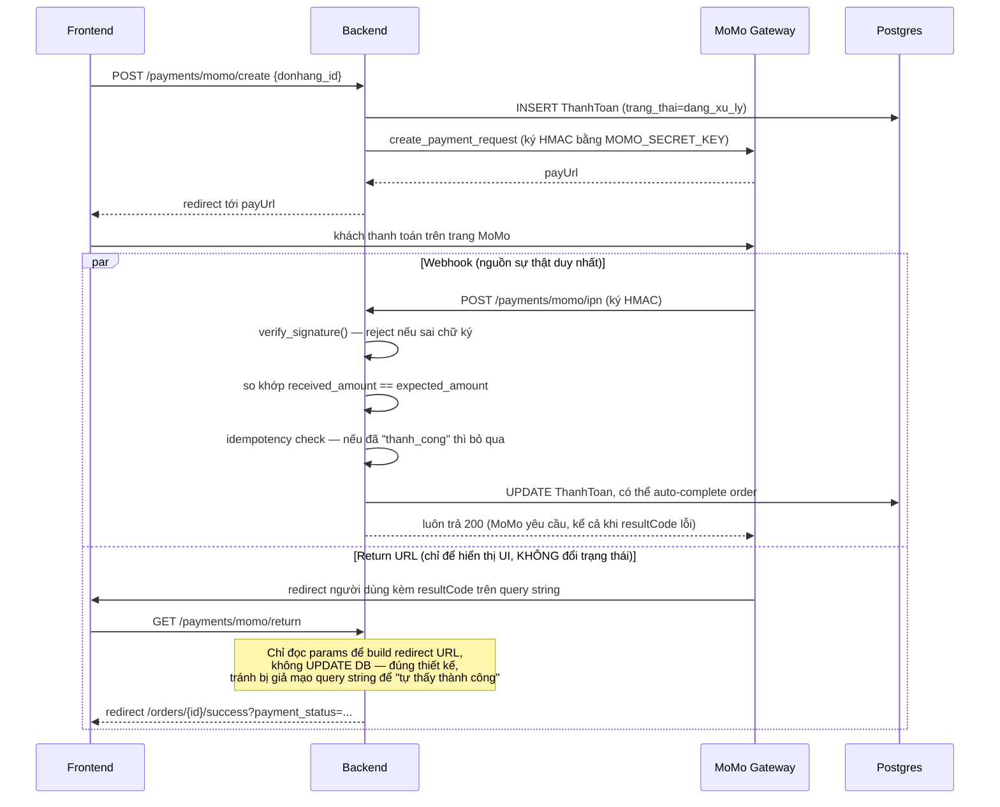
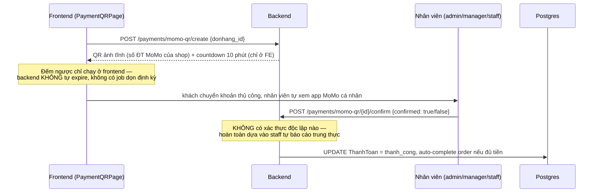
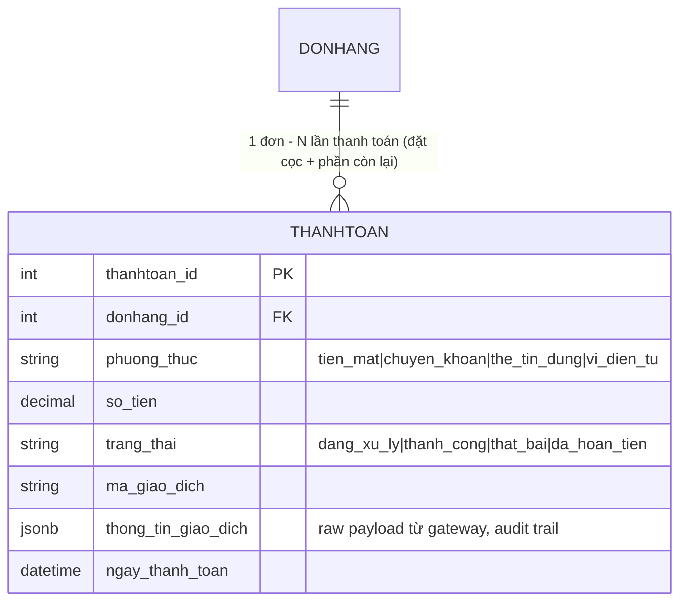

# Spec 03 — Payments

Status: DRAFT — chờ chốt.
Phạm vi: `app/routers/payments.py`, `app/services/payments/payment_service.py`, `app/services/momo.py`, `app/services/momo_qr.py`, frontend `CheckoutPage` (phần chọn phương thức thanh toán), `PaymentQRPage.tsx`, `OrderSuccessPage.tsx`, `services/paymentService.ts`.
Phụ thuộc ngược vào Orders (domain 2) — `_maybe_complete_order` dùng trực tiếp `order.tien_thanh_toan`, nên bug ở Orders domain 2 (voucher cộng dồn) lan sang đây, xem Finding #1.

---

## 1. Business Value

Payments là nơi tiền thật vào ra hệ thống — 3 kênh: tiền mặt/chuyển khoản thủ công (nhân viên nhập tay), MoMo Business API (tự động, có webhook xác nhận), MoMo QR thủ công (khách quét QR cá nhân của shop, nhân viên tự xác nhận bằng mắt). Mỗi thanh toán thành công phải khớp đúng với đơn hàng và tự động đẩy đơn sang `hoan_thanh` khi đủ tiền — sai ở đây nghĩa là hoặc mất tiền thật (khách trả tiền nhưng hệ thống không ghi nhận) hoặc mất hàng free (đơn được đánh dấu đã thanh toán nhưng chưa nhận đủ tiền).

## 2. Technical Design hiện tại

### 2.1 Luồng MoMo Business API (tự động, có chữ ký xác thực)



Điểm làm đúng: webhook là **nguồn sự thật duy nhất** để đổi trạng thái đơn — có verify chữ ký, so khớp số tiền, và có idempotency guard (`if payment.trang_thai == "thanh_cong": return "already confirmed"`, không xử lý lại). Return-URL (nơi user có thể tự sửa query string trên trình duyệt) chỉ dùng để hiển thị, không đụng DB. Đây là pattern chuẩn cho tích hợp cổng thanh toán — không nên coi return-URL là nguồn tin cậy, và code ở đây làm đúng.

### 2.2 Luồng MoMo QR thủ công — điểm cần lưu ý về kiểm soát nghiệp vụ



Đây không phải lỗ hổng kỹ thuật — MoMo QR cá nhân (không dùng Business API) vốn không có cách nào backend tự động biết tiền đã về hay chưa, nên xác nhận thủ công là lựa chọn hợp lý cho quy mô nhỏ. Nhưng cần ghi nhận rõ đây là **điểm kiểm soát nghiệp vụ yếu**: nhân viên có quyền tự đánh dấu "đã nhận tiền" mà không có bước đối soát nào (vd so với sao kê ngân hàng/app MoMo cuối ngày) — rủi ro gian lận nội bộ (nhân viên tự confirm đơn của mình/người quen mà không thực sự nhận tiền).

### 2.3 ERD



Một đơn có thể có **nhiều** bản ghi `ThanhToan` (vd đặt cọc trước, thanh toán phần còn lại sau) — `_total_paid()` cộng tất cả bản ghi `trang_thai=thanh_cong` của đơn, và `_maybe_complete_order()` so tổng đó với `order.tien_thanh_toan` để quyết định có tự chuyển đơn sang `hoan_thanh` hay không. Thiết kế đúng cho use-case đặt cọc.

## 3. Findings

### 🔴 HIGH — #1: Kế thừa bug từ Orders — đơn có `tien_thanh_toan` âm sẽ tự "hoàn thành" với 0 đồng

`_maybe_complete_order`:
```python
if total_paid >= (order.tien_thanh_toan or Decimal("0")) and order.trang_thai in _COMPLETABLE_STATUSES:
    order.trang_thai = "hoan_thanh"
```
Nếu Orders domain Finding #1 (nhiều voucher cộng dồn không cap tổng) xảy ra thật, `order.tien_thanh_toan` có thể âm. Khi đó `total_paid (0) >= số âm` luôn đúng — bất kỳ hành động nào chạm tới `_maybe_complete_order` (update trạng thái thanh toán, verify, MoMo IPN, xác nhận QR) đều có thể tự động đánh dấu đơn "hoàn thành" dù **chưa nhận một đồng nào**. Đây là lý do domain Payments được xếp risk cao thứ 2 sau Auth trong roadmap — bug ở Orders lan trực tiếp sang đây gây thất thoát thật.

**Đây là bằng chứng củng cố cho việc ưu tiên fix Orders Finding #1** (clamp `tien_thanh_toan >= 0`) — không cần fix riêng ở đây nếu Orders được fix đúng gốc, nhưng nếu muốn phòng thủ 2 lớp (defense in depth) có thể thêm `assert`/guard tại `_maybe_complete_order` từ chối hoàn thành đơn có `tien_thanh_toan <= 0` trừ khi đó là voucher 100% hợp lệ có chủ đích (đơn 0đ, ví dụ tặng miễn phí) — cần làm rõ business rule trước khi code phòng thủ này để không chặn nhầm ca hợp lệ.

### 🟡 MEDIUM — #2: MoMo QR thủ công không có bước đối soát độc lập

Xem mục 2.2. Đề xuất: thêm báo cáo cuối ngày liệt kê các thanh toán `vi_dien_tu` + `chi_tiet_raw.provider == "momo_qr"` đã confirm trong ngày, đối chiếu thủ công với sao kê MoMo thật — không cần tự động hoá ngay, chỉ cần có report để review định kỳ.

### 🟡 MEDIUM — #3: Không có expiry/cleanup tự động cho thanh toán "dang_xu_ly" bị bỏ dở

Đồng hồ đếm ngược 10 phút ở `PaymentQRPage.tsx` chỉ chạy trên trình duyệt — nếu khách đóng tab giữa chừng, `ThanhToan` vẫn nằm `dang_xu_ly` vô thời hạn, và **tồn kho đã bị trừ từ lúc tạo đơn** (theo luồng Orders domain 2) vẫn bị khoá cho đơn này mãi mãi trừ khi có người vào hủy tay. `OrderService.fail_unpaid_order()` đã tồn tại đúng để xử lý ca này (khôi phục tồn kho + hủy đơn) nhưng **không có gì gọi nó tự động theo thời gian** — chỉ được gọi khi có 1 tín hiệu thất bại rõ ràng (webhook fail, admin reject QR).

**Đề xuất**: thêm scheduled job (vd chạy mỗi 15 phút) quét các `ThanhToan.trang_thai == "dang_xu_ly"` quá X phút (ví dụ 30 phút, rộng hơn countdown UI để tránh race với khách đang thao tác) → gọi `fail_unpaid_order`.

### 🟢 LOW — #4: `create_payment` thiếu guard `or Decimal("0")` nhất quán

`remaining = order.tien_thanh_toan - total_paid` (dòng ~156) không có `(order.tien_thanh_toan or Decimal("0"))` như các method khác trong cùng file (`create_momo_payment`, `create_momo_qr_payment` đều có). Hiện không khai thác được vì cột `tien_thanh_toan` luôn được set trước khi commit trong `create_order` (không thực sự NULL ở runtime) — nhưng nên đồng bộ style để tránh bẫy nếu sau này có code path khác tạo đơn mà quên set giá trị này.

## 4. Điểm làm đúng

- **Webhook signature + amount verification + idempotency** — 3 lớp phòng thủ chuẩn cho tích hợp payment gateway, làm đúng cả 3.
- **Return-URL tách biệt khỏi trust boundary** — không cho phép user tự sửa query string để giả mạo trạng thái thanh toán.
- **`_ensure_order_access` dùng lại từ Orders/Payments** — khách chỉ thao tác được thanh toán của đơn mình, admin/manager toàn quyền — nhất quán, đã verify không sót method nào.

## 5. Modernize / New-feature roadmap

1. Fix Orders Finding #1 trước (giải quyết luôn Finding #1 domain này).
2. Scheduled cleanup cho thanh toán treo (Finding #3) — cần hạ tầng job scheduler (chưa có trong hệ thống hiện tại — ghi nhận cho domain Cross-cutting).
3. Báo cáo đối soát MoMo QR thủ công hàng ngày (Finding #2).
4. Tính năng mới cân nhắc: hỗ trợ hoàn tiền một phần (`da_hoan_tien` hiện chỉ đổi trạng thái, chưa có luồng gọi API hoàn tiền thật của MoMo hoặc ghi số tiền hoàn cụ thể nếu khác `so_tien` gốc).

---

**Lưu ý, không chặn tiến độ**: đã tự động qua domain 4 (Inventory) tiếp theo, sẽ note nếu có gì khẩn cấp.
