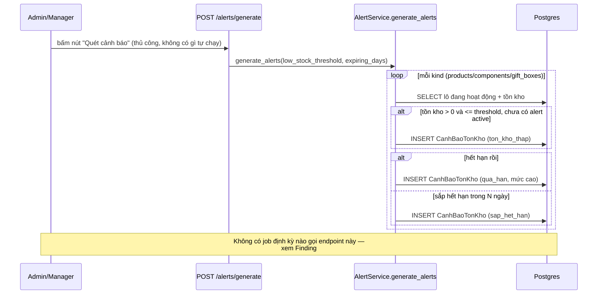

# Spec 04 — Inventory (Batches + Alerts + Trace)

Status: DRAFT — chờ chốt.
Phạm vi: `app/routers/{batches,alerts,inventory_trace}.py`, `app/services/{batches,alerts,inventory_trace}/*.py`, `app/services/inventory_ledger_service.py`.
FEFO tại thời điểm bán hàng (tiêu thụ tồn kho khi tạo đơn) đã audit ở Spec 02 (Orders) — domain này là phần "hậu cần": nhập lô, theo dõi cảnh báo, tra cứu lịch sử.

---

## 1. Business Value

Đây là "sổ sách" tồn kho — mọi lô hàng nhập (nguyên liệu, sản phẩm, hộp quà), mọi lần xuất/nhập/điều chỉnh đều phải có dấu vết (ledger) để truy vết khi có sai lệch kiểm kê. Alert hệ thống (sắp hết hạn, tồn kho thấp) tồn tại để nhân viên hành động trước khi mất hàng do hết hạn hoặc đứt hàng bán.

## 2. Technical Design hiện tại

### 2.1 Batches (nhập lô) — đã tổng quát hoá 3 kind (product/component/gift-box)

`BatchService` (đã refactor ở Phase 1) dùng chung 1 luồng create/list/get/update cho cả 3 loại lô hàng, tham số hoá qua `_BatchKind`. Mỗi lần tạo lô → tự động tạo dòng tồn kho (`TonKho*`) + 1 dòng ledger `nhap_hang`. Validate: trùng `ma_lo`, trùng `ma_qr` (đã fix ở Phase 1 — trước đó chỉ product được check, component/gift-box bị lọt qua DB constraint gây lỗi 500 thô), ngày hết hạn phải sau ngày nhập, nhà cung cấp phải tồn tại.

### 2.2 Alerts — sinh cảnh báo KHÔNG tự động



Cảnh báo đã tạo **không tự đóng lại** khi tình huống hết (vd nhập thêm hàng cho hết ton_kho_thap, hoặc lô đã bị huỷ) — phải có người vào `PUT /alerts/{id}` đổi `trang_thai` sang `da_xu_ly`/`bo_qua` thủ công.

### 2.3 Inventory Trace (đọc — audit/truy vết)

`GET /inventory-ledger` (lọc theo item_type/batch_id/movement_type/order_id/khoảng ngày) và `GET /batch-trace/{type}/{id}` (gộp: metadata lô + toàn bộ lịch sử ledger của lô + danh sách đơn hàng đã phân bổ từ lô đó) — thuần đọc, không có rủi ro ghi. Đã refactor ở Phase 1, gộp 3 khối query gần giống hệt bằng `_LedgerKind` config.

### 2.4 ERD

```mermaid
erDiagram
    LOHANGSANPHAM ||--|| TONKHOSANPHAM : "1-1"
    LOHANGSANPHAM ||--o{ LICHSUKHOSANPHAM : "ledger"
    LOHANGSANPHAM ||--o{ CANHBAOTONKHO : "cảnh báo"
    LOHANGSANPHAM {
        int lohang_id PK
        string ma_lo UK
        string ma_qr UK "nullable, unique khi có"
        datetime ngay_het_han
        string trang_thai "hoatdong — KHÔNG tự đổi khi hết hàng"
    }
    TONKHOSANPHAM {
        int lohang_sanpham_id PK_FK
        int so_luong_hien_tai
        int so_luong_da_ban
    }
    LICHSUKHOSANPHAM {
        int lichsu_id PK
        string loai_giao_dich "nhap_hang|xuat_ban|xuat_huy|dieu_chinh|kiem_ke|tra_hang|xuat_bom"
        int so_luong_truoc
        int so_luong_sau
    }
    CANHBAOTONKHO {
        int canhbao_id PK
        string loai_canh_bao "het_han|sap_het_han|ton_kho_thap|qua_han"
        string trang_thai "chua_xu_ly|dang_xu_ly|da_xu_ly|bo_qua — không tự chuyển"
    }
```
(Component/gift-box có cấu trúc song song tương tự, đã gộp logic qua config thay vì lặp 3 lần trong code.)

## 3. Findings

### 🟠 HIGH — #1: Cảnh báo tồn kho/hết hạn không tự sinh — phụ thuộc hoàn toàn vào việc ai đó nhớ bấm nút

`POST /alerts/generate` chỉ chạy khi có người chủ động gọi. Không có scheduled job/cron nào trong hệ thống (đã xác nhận: không tìm thấy hạ tầng job-scheduler ở đâu trong codebase — cùng gốc vấn đề với Payments Finding #3: không có cách nào chạy tác vụ định kỳ). Hệ quả: nếu không ai vào admin panel bấm "Quét cảnh báo" đều đặn, sản phẩm hết hạn/hết hàng có thể trôi qua mà không ai được cảnh báo — đúng lúc tính năng này sinh ra để tránh.

**Đề xuất**: thêm hạ tầng chạy tác vụ định kỳ (APScheduler nếu muốn đơn giản, không cần thêm service ngoài như Celery/Redis cho quy mô hiện tại — đúng theo nguyên tắc "Minimal but Valuable" của dự án, không thêm Redis/Kafka chỉ vì muốn có). Chạy `generate_alerts` mỗi ngày (vd 6h sáng) là đủ cho use-case này, không cần realtime.

### 🟡 MEDIUM — #2: Cảnh báo không tự đóng khi tình huống đã hết

Sau khi nhập thêm hàng cho 1 lô đang bị cảnh báo "tồn kho thấp", cảnh báo cũ vẫn còn `chua_xu_ly` — không có logic nào tự kiểm tra lại và đóng cảnh báo đã lỗi thời. Nếu domain không được dùng thường xuyên để dọn (`PUT` đổi trạng thái thủ công), danh sách cảnh báo sẽ tích tụ noise, làm giảm giá trị thực của tính năng (nhân viên lướt qua không còn tin tưởng, "báo động giả" quen thuộc).

**Đề xuất**: khi chạy `generate_alerts`, đồng thời auto-resolve (`trang_thai = da_xu_ly`, ghi chú "auto-resolved") các cảnh báo `ton_kho_thap` mà tồn kho hiện tại đã vượt threshold, và cảnh báo `sap_het_han`/`qua_han` mà lô đã bị set `trang_thai != hoatdong` (ngừng bán/huỷ).

### 🟢 LOW — #3: `loai_canh_bao` có giá trị `het_han` trong ENUM nhưng generator không bao giờ tạo ra

Code chỉ sinh `qua_han` cho lô đã hết hạn, không bao giờ dùng `het_han`. Enum vẫn khai báo đủ 4 giá trị đúng khớp DB — không phải bug, chỉ là 1 giá trị enum chết, dọn dẹp sau cũng được, không ưu tiên.

## 4. Điểm làm đúng

- **QR-duplicate fix (Phase 1)** đã đóng đúng lỗ hổng: trước đây chỉ product-batch được check trùng `ma_qr` ở tầng app, component/gift-box lọt qua và văng lỗi 500 thô khi đụng UNIQUE constraint ở DB — giờ cả 3 kind đều check nhất quán.
- **Ledger ghi số lượng trước/sau mỗi giao dịch** (`so_luong_truoc`/`so_luong_sau`) — đủ dữ liệu để dựng lại lịch sử tồn kho tại bất kỳ thời điểm nào, đúng chuẩn audit trail.

## 5. Modernize / New-feature roadmap

1. Hạ tầng scheduled job (Finding #1) — nền tảng dùng chung cho cả Inventory alerts lẫn Payments cleanup (Spec 03 Finding #3). Nên làm 1 lần, dùng chung.
2. Auto-resolve cảnh báo lỗi thời (Finding #2).
3. Tính năng mới cân nhắc: dashboard tồn kho theo thời gian thực (biểu đồ xu hướng xuất/nhập) — dữ liệu ledger đã đủ đầy đủ để dựng, chỉ cần thêm 1 endpoint tổng hợp.

---

Tiếp tục tự động qua domain 5 (Products & Gift Boxes).
