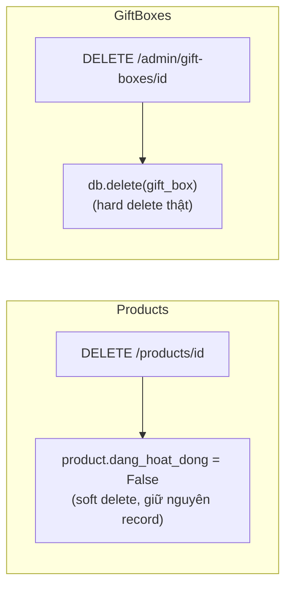
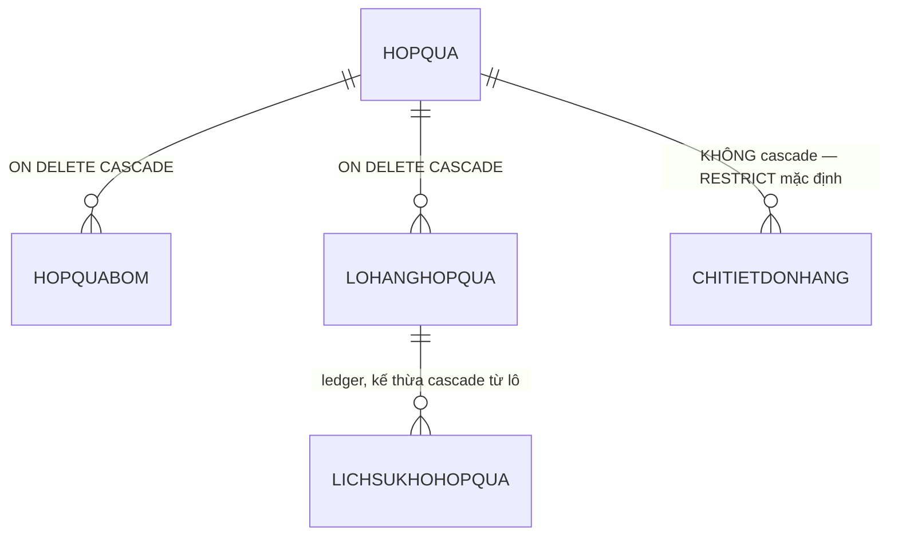

# Spec 05 — Products & Gift Boxes (catalog)

Status: DRAFT — chờ chốt.
Phạm vi: `app/routers/{products,gift_boxes}.py`, `app/services/{products,gift_boxes}/*.py`.

---

## 1. Business Value

Catalog — sản phẩm (bánh, có biến thể theo hương vị/kích thước) và hộp quà (gift box, có BOM — công thức gồm nhiều biến thể sản phẩm). Đây là dữ liệu khách hàng nhìn thấy trực tiếp trên storefront, đồng thời là gốc cho toàn bộ luồng Orders/Inventory phía sau (biến thể sản phẩm là đơn vị FEFO allocate, BOM hộp quà quyết định trừ kho nguyên liệu nào khi bán 1 hộp quà).

## 2. Technical Design hiện tại

Cả 2 đều CRUD tương đối đơn giản, đã refactor Phase 1. Điểm khác biệt đáng chú ý nhất domain này: **2 cách xoá khác nhau cho 2 loại dữ liệu tương tự nhau**.

`GiftBoxService.delete_gift_box` xoá cứng — trong khi `ProductService.delete_product` xoá mềm (set `dang_hoat_dong=False`). Đây không phải style khác nhau vô hại — nó kéo theo hệ quả FK thật ở tầng DB (xem Finding #1).

### 2.1 ERD (FK liên quan tới xoá hộp quà)

## 3. Findings

### 🔴 HIGH — #1: `delete_gift_box` xoá cứng — 2 kịch bản đều xấu

Kiểm tra trực tiếp trong migration (`alembic/versions/0001_baseline.py`):
- `chitietdonhang.hop_qua_id -> hopqua.hop_qua_id` **không có** `ON DELETE CASCADE` (mặc định RESTRICT).
- `hopquabom.hop_qua_id -> hopqua.hop_qua_id` **CÓ** `ON DELETE CASCADE`.
- `lohanghopqua.hop_qua_id -> hopqua.hop_qua_id` **CÓ** `ON DELETE CASCADE`.

Hệ quả cụ thể, 2 kịch bản:

1. **Hộp quà đã từng được bán** (có dòng trong `ChiTietDonHang`) → `db.delete(gift_box)` tại tầng Postgres bị chặn bởi FK RESTRICT, ném `IntegrityError`. Service/router hiện **không có try/except nào bắt lỗi này** → lọt qua `DomainError` handler, rơi xuống catch-all `Exception` của `main.py` → client nhận **500 thô** thay vì thông báo rõ ràng "không thể xoá, hộp quà đã có trong đơn hàng". Đây đúng là dạng bug đã fix ở Phase 1 cho `ma_qr` trùng lặp trong Batches (xem Spec 04) — cùng một loại lỗi: thiếu check tầng app trước khi để DB tự chặn bằng exception thô.

2. **Hộp quà chưa từng được bán nhưng đã có lô nhập kho** (có dòng trong `LoHangHopQua`, tức đã nhập nguyên liệu/thành phẩm cho hộp quà này dù chưa bán) → xoá **thành công**, nhưng CASCADE kéo theo xoá sạch toàn bộ `LoHangHopQua` liên quan, và (nếu ledger cũng cascade theo lô, cần verify thêm ở migration) có thể mất luôn lịch sử nhập/xuất kho của hộp quà đó — mất dấu vết dù chưa hề vi phạm nguyên tắc "đã bán thì không xoá được".

So sánh: `ProductService.delete_product` làm đúng (soft delete) — không gặp vấn đề này vì record không bao giờ bị xoá thật.

**Đề xuất fix**: đổi `delete_gift_box` sang soft-delete giống `delete_product` (set `dang_hoat_dong=False`), nhất quán trong cùng domain catalog. Nếu có nhu cầu thật sự cần xoá cứng (dọn dữ liệu test/rác), thêm check tầng app trước: nếu có `ChiTietDonHang` hoặc `LoHangHopQua` tham chiếu → trả 400 rõ ràng thay vì để DB tự raise.

### 🟢 LOW — #2: `create_gift_box` tự sinh SKU kiểu `GIFTBOX-{max_id+1}` nếu không truyền

`max_id = db.query(func.max(HopQua.hop_qua_id)).scalar() or 0` rồi `+1` — race condition nhẹ nếu 2 request tạo hộp quà cùng lúc không truyền SKU (2 request đều đọc cùng `max_id` trước khi request nào insert xong) có thể sinh trùng SKU. Vì cột `sku` có UNIQUE constraint nên request thứ 2 sẽ bị DB chặn — nhưng lại rơi vào đúng pattern lỗi ở Finding #1 (IntegrityError không được app bắt trước) nếu không catch. Rủi ro thấp (tạo hộp quà đồng thời hiếm khi xảy ra ở quy mô admin panel), nhưng đáng ghi nhận vì cùng gốc thiếu-check-trước-khi-insert.

## 4. Điểm làm đúng

- `ProductService.delete_product`/`delete_variant` dùng soft-delete nhất quán, đúng chuẩn cho dữ liệu catalog có thể đã được tham chiếu ở nơi khác.
- Validate trùng SKU (product, variant, gift box) đều check tầng app trước khi insert — đúng pattern, chỉ riêng path xoá gift box là thiếu tương tự.

## 5. Modernize / New-feature roadmap

1. Fix Finding #1 — đổi gift box sang soft-delete, ưu tiên cao vì đây là data-loss risk thật, không phải lý thuyết.
2. Thêm app-level check trùng SKU tự sinh cho gift box (Finding #2) — effort thấp.
3. Tính năng mới cân nhắc: xem trước "sức chứa" hộp quà — dựa BOM + tồn kho hiện tại của từng biến thể, tính được tối đa bao nhiêu hộp quà có thể lắp ráp ngay bây giờ (hữu ích cho vận hành, dữ liệu đã đủ để tính, chỉ thiếu 1 endpoint tổng hợp).

---

Tiếp tục tự động qua domain 6 (Users & Suppliers).
