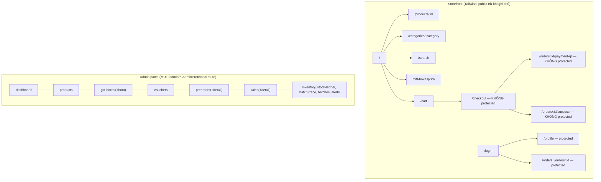

# Spec 07 — Frontend UI/UX flows

Status: DRAFT — chờ chốt.
Phạm vi: routing tổng thể (`App.tsx`), route-guarding, storefront (17 trang, Tailwind + design token riêng), admin panel (15 trang, MUI).
Đã audit riêng trước đây trong cùng engagement này (không lặp lại chi tiết ở đây): mobile Cart/Checkout — đã fix 2 bug thật (order summary hiển thị dưới CTA trên mobile, nút +/- số lượng trong giỏ hàng quá nhỏ cho thao tác chạm) + fix theme MUI DatePicker dùng token CSS thay vì hex cứng + gỡ tính năng Scan SKU khỏi trang khách hàng (chỉ dành nội bộ nhập hàng).

---

## 1. Business Value

Storefront là nơi khách hàng trực tiếp tương tác — trải nghiệm mượt, không có màn hình trắng/lỗi khó hiểu quyết định tỷ lệ chuyển đổi (từ xem sản phẩm → thêm giỏ → thanh toán thành công). Admin panel là công cụ nội bộ — ưu tiên chức năng đầy đủ hơn là thẩm mỹ, nhưng vẫn cần nhất quán để tránh nhân viên thao tác nhầm.

## 2. Kiến trúc hiện tại

### 2.1 Route map (từ `App.tsx`)

### 2.2 Tách stack có chủ đích: Tailwind (storefront) vs MUI (admin)

Xác nhận qua kiểm tra toàn bộ `frontend/src`: **toàn bộ** 15 trang + component admin dùng MUI, **toàn bộ** 17 trang storefront dùng Tailwind/design token riêng — tách biệt sạch theo route, không trộn lẫn trong cùng 1 trang. Đây là quyết định đã ghi nhận từ trước (không phải phát hiện mới): admin ưu tiên tốc độ phát triển (MUI có sẵn component phức tạp: DataGrid, DatePicker...), storefront ưu tiên đúng thương hiệu (Tailwind + token riêng). Việc "đồng bộ MUI→Tailwind cho admin" đã được xác định là **out of scope, để sau** trong 1 quyết định trước đó của m — nhắc lại ở đây cho đủ bức tranh domain, không phải đề xuất làm ngay.

## 3. Findings

### 🟡 MEDIUM — #1: `/checkout`, `/orders/:id/payment-qr`, `/orders/:id/success` không bọc `ProtectedRoute`

Khác với `/profile`, `/orders`, `/orders/:id` (đều bọc `<ProtectedRoute>`, tự động redirect `/login` nếu chưa đăng nhập), 3 route trong luồng thanh toán lại không có guard này. Backend vẫn chặn đúng (API `POST /orders` yêu cầu `get_current_user`, trả 401) — không phải lỗ hổng bảo mật — nhưng trải nghiệm khác biệt: khách chưa đăng nhập điền hết form checkout, bấm "Đặt hàng", mới nhận lỗi 401 khó hiểu ở bước cuối, thay vì được đưa thẳng tới `/login` ngay từ khi vào trang.

**Đề xuất**: bọc `/checkout` bằng `<ProtectedRoute>` giống các route khác — nhất quán và giảm 1 bước thất vọng cho khách.

### 🟢 LOW — #2: Không có catch-all route (404 page)

`<Routes>` trong `App.tsx` không có `<Route path="*" element={...} />`. URL sai/link cũ/bookmark hỏng sẽ render trắng thay vì trang "Không tìm thấy" thân thiện. Effort sửa rất thấp (thêm 1 route + 1 component đơn giản), nên làm dù ưu tiên không cao.

### 🟢 LOW — #3: `AdminProtectedRoute` — đã ghi nhận ở Spec 01 (Auth)

Không lặp lại chi tiết — chỉ nhắc: fallback `vaitro_id === 1` để đoán admin nên bỏ, chỉ giữ so tên role. Xem Spec 01 Finding #6.

## 4. Điểm làm đúng

- Tách route admin qua nested `<Route path="/admin/*">` với `AdminLayout` dùng chung — cấu trúc rõ ràng, dễ thêm trang admin mới.
- Đã tự audit và fix mobile Cart/Checkout trước khi bắt đầu đợt spec hoá này (2 bug UX thật đã fix, xem đầu file) — phần responsive cốt lõi của luồng mua hàng đã ở trạng thái tốt.
- Tách bạch design system storefront/admin theo route, không trộn lẫn trong cùng trang — giữ ranh giới rõ ràng dù dùng 2 stack khác nhau.

## 5. Modernize / New-feature roadmap

1. Fix Finding #1 (bọc ProtectedRoute cho luồng checkout) — effort thấp, cải thiện UX ngay.
2. Thêm 404 page (Finding #2) — effort rất thấp.
3. Đồng bộ MUI → Tailwind cho admin — đã note là việc lớn, để sau khi m tự review xong phần nhìn tổng thể (theo đúng quyết định trước đó, không đổi ở đây).
4. Tính năng mới cân nhắc: quên mật khẩu (đã note ở Spec 01, đây là nơi cần thêm UI khi backend có endpoint).

---

Tiếp tục tự động qua domain 8 (Cross-cutting — tổng hợp DB ERD toàn hệ thống, Analytics/Reports, Events/Middleware/Infra) — domain cuối cùng trong roadmap.
