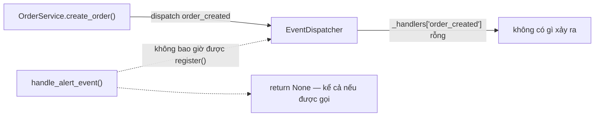
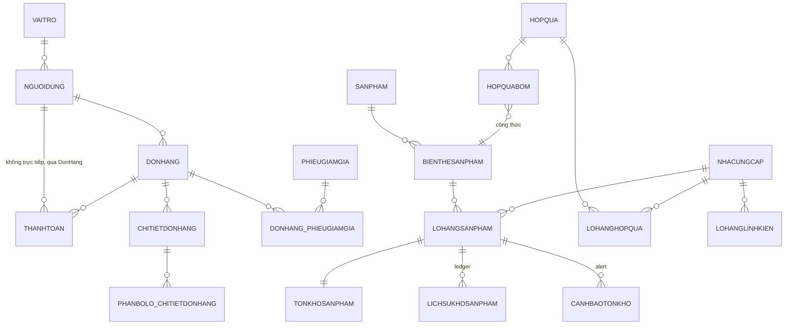

# Spec 08 — Cross-cutting (hạ tầng dùng chung + tổng hợp toàn hệ thống)

Status: DRAFT — chờ chốt. Đây là domain cuối cùng trong roadmap audit (Spec 01–08).
Phạm vi riêng của domain này: `app/events/*`, `app/middleware/*`, hạ tầng thiếu (job scheduler), và phần tổng hợp/kết luận toàn bộ 8 domain đã audit.

---

## 1. Event system — scaffolding chết hoàn toàn, chưa từng chạy 1 dòng logic nào

Đây là phát hiện đáng chú ý nhất domain này. `app/events/dispatcher.py` định nghĩa 1 `EventDispatcher` (pub/sub trong-process, đồng bộ, chạy trong cùng transaction DB). `OrderService`/`PaymentService` đã **gọi `dispatcher.dispatch(...)`** ở đúng những điểm hợp lý về nghiệp vụ: `order_created`, `order_cancelled`, `payment_failed`, `inventory_restored` (xem Spec 02, 03).

Nhưng:

```python
# app/events/dispatcher.py
def dispatch(self, db: Session, event: DomainEvent) -> None:
    for handler in self._handlers.get(event.name, []):   # luôn rỗng
        handler(db, event)
```

Kiểm tra toàn bộ codebase: **không có bất kỳ lời gọi `dispatcher.register(...)` nào** ở đâu cả. `self._handlers` luôn là dict rỗng suốt vòng đời ứng dụng — mọi `dispatch()` là no-op tuyệt đối. 3 hàm xử lý đã viết sẵn (`handle_alert_event`, `handle_analytics_event`, `handle_inventory_event` trong `app/events/handlers/`) **cũng đều rỗng** (`return None`) — dù có được register thì cũng chẳng làm gì.



**Đây trực tiếp vi phạm nguyên tắc chính chủ dự án**: "Minimal but Valuable — every service must have a reason for existing. If removing a service leaves the product largely unchanged, consider eliminating it." Xoá toàn bộ `app/events/` ngay bây giờ **không đổi hành vi hệ thống dù chỉ 1 chút** — chứng minh rõ ràng nó chưa từng có giá trị thực từ khi được viết ra.

**Nhưng đừng vội xoá** — tên các hàm rỗng gợi ý rõ ý định ban đầu, và ý định đó thực ra **giải quyết đúng 2 finding đã nêu ở domain khác**:
- `handle_alert_event` khi `order_cancelled`/`inventory_restored` bắn ra → có thể tự động chạy lại `AlertService.generate_alerts` cho các lô liên quan → giải quyết một phần Spec 04 Finding #1/#2 (cảnh báo không tự sinh/tự đóng) mà không cần chờ có hạ tầng scheduled job.
- `handle_analytics_event` → ghi nhận sự kiện kinh doanh theo thời gian thực thay vì tính lại từ đầu mỗi lần gọi `/analytics/best-sellers`.

**Đề xuất, chọn 1 trong 2 hướng dứt khoát, không để lửng như hiện tại:**
1. **Hoàn thiện**: viết logic thật cho 3 handler, gọi `dispatcher.register()` ở `app/main.py` lúc khởi động app. Việc này tận dụng đúng những điểm `dispatch()` đã có sẵn, không cần sửa Orders/Payments.
2. **Xoá bỏ**: nếu không có kế hoạch dùng trong ngắn hạn, xoá `app/events/` + các lời gọi `dispatch()` liên quan, giảm code không ai maintain/hiểu ý định.

## 2. Pattern lỗi lặp lại xuyên suốt — tổng hợp

Đã phát hiện **cùng 1 loại lỗi ở ít nhất 4 nơi** trong quá trình audit domain-by-domain — đủ để kết luận đây là vấn đề kiến trúc, không phải lỗi đơn lẻ:

| # | Domain | Chỗ | Đã fix? |
|---|---|---|---|
| 1 | Inventory (Batches) | `ma_qr` trùng lặp ở component/gift-box batch — thiếu check app-level, DB tự raise `IntegrityError` → 500 | ✅ Đã fix ở Phase 1 |
| 2 | Products & Gift Boxes | `delete_gift_box` hard-delete, không check `ChiTietDonHang`/`LoHangHopQua` tham chiếu trước | ❌ Chưa fix (Spec 05 #1) |
| 3 | Users & Suppliers | `delete_user` hard-delete, không check ledger tham chiếu — gần như chắc chắn bị hit trong thực tế | ❌ Chưa fix (Spec 06 #1) |
| 4 | Users & Suppliers | `delete_supplier(hard_delete=True)` cùng lỗi, có TODO gốc tự thừa nhận | ❌ Chưa fix (Spec 06 #2) |

**Đề xuất kiến trúc dùng chung**: thay vì vá riêng từng chỗ, viết 1 helper `_ensure_no_references(db, model, fk_map, not_found_detail)` tái sử dụng được cho mọi thao tác hard-delete trong hệ thống — check tất cả bảng con tham chiếu trước khi `db.delete()`, trả `DomainError(400, ...)` rõ ràng nếu có. Đặt ở `app/services/errors.py` hoặc 1 module dùng chung mới, để lần sau viết thêm hard-delete endpoint không lặp lại lỗi này lần thứ 5.

## 3. Hạ tầng còn thiếu: không có job scheduler

Đã nhắc tới ở 2 domain riêng biệt (Spec 03 Payments Finding #3 — dọn thanh toán treo; Spec 04 Inventory Finding #1 — tự sinh cảnh báo) — xác nhận ở đây: **không tìm thấy bất kỳ cơ chế chạy tác vụ định kỳ nào** trong toàn bộ codebase (không cron, không APScheduler, không Celery beat). Đây là 1 hạ tầng dùng chung cần làm 1 lần, phục vụ ít nhất 2 nhu cầu đã xác định. Đề xuất APScheduler (chạy trong cùng process FastAPI, không cần thêm service ngoài như Redis/Celery) — đúng nguyên tắc "Minimal but Valuable" của dự án, không thêm hạ tầng nặng cho nhu cầu hiện tại (vài job/ngày).

## 4. Middleware — quan sát nhỏ, không phải bug

- `SecurityMiddleware` set đúng các header bảo mật chuẩn (`X-Content-Type-Options`, `X-Frame-Options`, `Permissions-Policy`...). Có 1 comment `TODO(phase-1)` **có sẵn từ trước** (không phải do đợt Phase 1 refactor của tôi) tự ghi chú 1 danh sách `_cors_headers` được khai báo nhưng không dùng tới ở đâu — tác giả gốc đã tự xác nhận đây "không phải bug sống", chỉ là code thừa chưa dọn. Ưu tiên rất thấp.
- `LoggingMiddleware` log ra console dạng text thuần (không structured/JSON), không có tích hợp gửi tới hệ thống log tập trung nào. Đủ dùng cho quy mô hiện tại; nếu "revive" lên production thật, nên cân nhắc log JSON để dễ query/alert (không cấp bách).

## 5. ERD tổng thể (rút gọn — chi tiết từng domain xem Spec 02/04/05)



## 6. Tổng hợp toàn bộ audit — bảng ưu tiên hành động (8 domain)

| Ưu tiên | Finding | Domain | Trạng thái |
|---|---|---|---|
| 🔴 Đã fix | Privilege escalation qua `/auth/register` | Auth (01) | ✅ Đã fix trong đợt audit này |
| 🔴 Chưa fix | `DELETE /orders/{id}` hard-delete phá audit trail | Orders (02) | Chờ quyết định |
| 🔴 Chưa fix | Voucher cộng dồn có thể làm `tien_thanh_toan` âm → lan sang Payments tự "hoàn thành" đơn 0đ | Orders (02) + Payments (03) | Chờ quyết định |
| 🟠 Chưa fix | Cảnh báo tồn kho/hết hạn không tự sinh (không ai bấm = không ai biết) | Inventory (04) | Chờ quyết định |
| 🟠 Chưa fix | `delete_user` hard-delete gần như chắc chắn 500 khi user có lịch sử kho | Users (06) | Chờ quyết định |
| 🟡 Chưa fix | `delete_gift_box` hard-delete, cùng pattern lỗi | Products (05) | Chờ quyết định |
| 🟡 Chưa fix | `delete_supplier(hard_delete=True)` cùng pattern lỗi | Suppliers (06) | Chờ quyết định |
| 🟡 Chưa fix | Không silent refresh-token → mất session sau 30 phút | Auth (01) | Chờ quyết định |
| 🟡 Chưa fix | Voucher usage-limit race condition (thiếu row-lock) | Orders (02) | Chờ quyết định |
| 🟡 Chưa fix | `update_order_status` không validate transition | Orders (02) | Chờ quyết định |
| 🟡 Chưa fix | MoMo QR thủ công thiếu đối soát | Payments (03) | Chờ quyết định |
| 🟡 Chưa fix | Không cleanup thanh toán treo tự động | Payments (03) | Chờ quyết định (cùng hạ tầng job scheduler) |
| 🟡 Chưa fix | `/checkout` không bọc ProtectedRoute | Frontend (07) | Chờ quyết định |
| 🟢 Đã ghi nhận | Event system chết hoàn toàn — hoàn thiện hoặc xoá | Cross-cutting (08) | Chờ quyết định |
| 🟢 Thấp | Không có job scheduler (hạ tầng nền cho 3 finding trên) | Cross-cutting (08) | Chờ quyết định |
| 🟢 Thấp | Không có 404 page, forgot-password, vài dọn dẹp nhỏ khác | Frontend/Auth | Đã note, không cấp bách |

## 7. Điểm làm đúng xuyên suốt hệ thống (đáng ghi nhận thật, không phải xã giao)

- FEFO + row-lock cho phân bổ tồn kho (Orders) — thiết kế concurrency-safe đúng chuẩn, hiếm gặp ở dự án quy mô này.
- Webhook MoMo: verify chữ ký + so khớp số tiền + idempotency — 3 lớp phòng thủ chuẩn, làm đúng cả 3.
- Giá luôn snapshot/tính lại từ server, không bao giờ tin client — nhất quán từ Orders tới Payments.
- Soft-delete đúng chuẩn cho Product/User-update-role/Supplier-mặc-định — chỉ riêng vài hard-delete endpoint là ngoại lệ (đã liệt kê ở trên), không phải toàn hệ thống sai.

---

**Đã hoàn thành cả 8 domain trong roadmap audit ban đầu.** Toàn bộ spec nằm ở `docs/specs/01` → `08`, mỗi file có sequence/ERD diagram + finding phân mức độ + roadmap riêng. Đây là lúc phù hợp để m review tổng thể 1 lượt (theo đúng cách làm việc "chốt xong domain này mới qua domain khác" ban đầu, giờ đã đi hết vòng) và quyết định thứ tự fix cho bảng ưu tiên ở mục 6.
